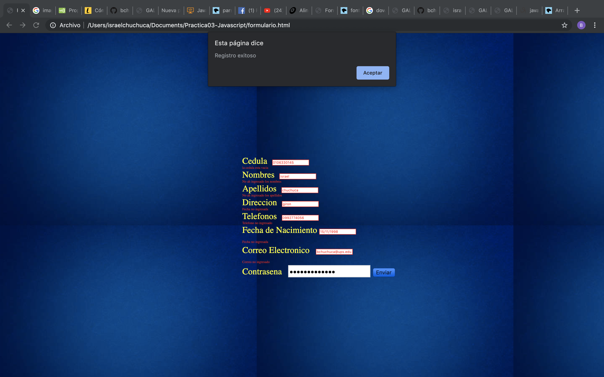
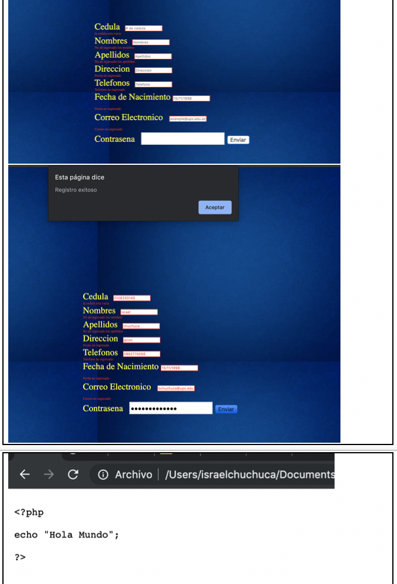
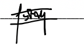

# Practica03JavaScript2

 	FORMATO DE INFORME DE PRÁCTICA DE LABORATORIO / TALLERES / CENTROS DE SIMULACIÓN – PARA ESTUDIANTES

CARRERA:Computacion	ASIGNATURA:Programacion hipermedial
NRO. PRÁCTICA:		TÍTULO PRÁCTICA:JavaScript html
OBJETIVO ALCANZADO:aplicar funcionalidades javascript y html
ACTIVIDADES DESARROLLADAS
1.	1. Crear un repositorio en GitHub con el nombre “Practica03 – Javascript”  
https://github.com/bchuchucaa

2. Diseñar una interfaz en HTML que permita ingresar los siguientes campos en un formulario: cedula, nombres, apellidos, dirección, teléfono, fecha de nacimiento, correo electrónico y contraseña. 
 

 

3. Se debe validar qué, en el campo de la cedula, se ingrese sólo números y que la misma sea correcta, en base, al último dígito verificador.

function soloNumeros(e)
{
	var key = window.Event ? e.which : e.keyCode
	return ((key >= 48 && key <= 57) || (key==8))	
}
function validarCedula() {
  console.log();
  var cad = document.getElementById("cedula").value.trim();
  var total = 0;
  var longitud = cad.length;
  var longcheck = longitud - 1;

  if (cad !== "" && longitud === 10) {
    for (i = 0; i < longcheck; i++) {
      if (i % 2 === 0) {
        var aux = cad.charAt(i) * 2;
        if (aux > 9) aux -= 9;
        total += aux;
      } else {
        total += parseInt(cad.charAt(i)); // parseInt o concatenará en lugar de sumar
      }
    }

    total = total % 10 ? 10 - total % 10 : 0;

    if (cad.charAt(longitud - 1) == total) {
      console.log("La cedula" + " es valida");

    } else {
      alert("Error: La cedula" + " es invalida");
      document.getElementById('cedula').style.border='1px red solid';
      document.getElementById('mensajeCedula').innerHTML='  la cedula invalida';
      return false;
    }
  }
}

4. Se debe validar qué, en el campo del nombres, ingrese mínimo un nombre y que permita ingresar sólo letras.

function soloLetras(e){
	key = e.keyCode || e.which;
	tecla = String.fromCharCode(key).toLowerCase();
	letras = " áéíóúabcdefghijklmnñopqrstuvwxyz";
	especiales = "8-37-39-46";

	tecla_especial = false
	for(var i in especiales){
		if(key == especiales[i]){
			tecla_especial = true;
			break;
		}
	}
  
  
  
5. Se debe validar qué, en el campo del apellidos, ingrese mínimo un apellido y que permita ingresar sólo letras.

function soloLetras(e){
	key = e.keyCode || e.which;
	tecla = String.fromCharCode(key).toLowerCase();
	letras = " áéíóúabcdefghijklmnñopqrstuvwxyz";
	especiales = "8-37-39-46";

	tecla_especial = false
	for(var i in especiales){
		if(key == especiales[i]){
			tecla_especial = true;
			break;
		}
	}
  
  
6. Se debe validar qué, en el campo del teléfono, permita ingresar sólo números y un máximo de 10.

function validarTelefono(elemento){
	if (elemento.value.length <11) {
		return false;
	}else{
		elemento.value=elemento.value.substring(0,elemento.value.length-1);
	}

}

7. Se debe validar que la fecha de nacimiento ingrese en el formato dd/mm/yyyy.

function validar(){
	let input = document.getElementById('fecha_nac').value;
	var reg = /(0[1-9]|[12][0-9]|3[01])[- /.](0[1-9]|1[012])[- /.](19|20)\d\d/;
	if (input.match(reg)) {
		console.log("formato correcto de la fecha");
	}else {
		console.log("Please enter dd/mm/yyyy");
		alert('Fecha ingresada incorrectamente');
		  document.getElementById('fecha_nac').style.border='1px red solid';
      document.getElementById('mensajeFecha').innerHTML='  Formato invalido';
      return false;
	}
}
8. Se debe validar qué, en el campo correo electrónico, permita ingresar un correo válido. Se considera un correo válido, cuando comienza por tres o más valores alfanuméricos, luego un @, seguido por la extensión “ups.edu.ec” o “est.ups.edu.ec”.

function validarEmail(){
	var cadena = document.getElementById('correo').value,
    separador = "@", // un espacio en blanco
    arregloDeSubCadenas = cadena.split(separador);
    if((arregloDeSubCadenas[1]==='est.ups.edu.ec' || arregloDeSubCadenas[1]==='ups.edu.ec') && arregloDeSubCadenas[0].length > 2  ){
    	console.log('correo valido');
    	return true;
    	
    }else{
    	  document.getElementById('correo').style.border='1px red solid';
    	  document.getElementById('mensajeCorreo').innerHTML=' correo invalido';
    	console.log('correo invalido');
    	return false;
    }

    console.log(arregloDeSubCadenas);
}
9. Se debe validar que la contraseña ingresada tenga mínimo 8 caracteres, además, debe incluir al menos: una letra mayúscula, una letra minúscula y un carácter especial (@, _, $)

function validar_clave()
{
	let contrasenna= document.getElementById('password').value;
	console.log(contrasenna)
	
	if(contrasenna.length > 7)
	{		
		var mayuscula = false;
		var minuscula = false;
		var numero = false;
		var caracter_raro = false;

		for(var i = 0;i<contrasenna.length;i++)
		{
			if(contrasenna.charCodeAt(i) >= 65 && contrasenna.charCodeAt(i) <= 90)
			{
				mayuscula = true;
			}
			else if(contrasenna.charCodeAt(i) >= 97 && contrasenna.charCodeAt(i) <= 122)
			{
				minuscula = true;
			}
			else if(contrasenna.charCodeAt(i) >= 48 && contrasenna.charCodeAt(i) <= 57)
			{
				numero = true;
			}
			else
			{
				caracter_raro = true;
			}
		}
		if(mayuscula == true && minuscula == true && caracter_raro == true && numero == true)
		{
			
			return true;
		}
	}
	  document.getElementById('password').style.border='1px red solid';
	document.getElementById('mensajePassword').innerHTML=' Contrasena invalida';
	console.log('Clave no cumple con los requisitos');
	return false;
	
}
10. Diseñar una interfaz en html que tenga tres botones que diga “Anterior”, “Iniciar”, “Siguiente”, y una imagen. Luego, desde javascript se debe controlar para al hacer clic sobre uno de los botones realice una acción relacionada a una galería de imágenes (ver ejemplo, https://gihp4c.blog.ups.edu.ec/)
 

11. Cada vez que se haga clic en le botón iniciar se deben escoger de manera
aleatoria cinco imágenes de las diez que se mostrarán en la galería de
imágenes.
var num=0;
var misImagenes= new Array(5)

for (var i = 0; i <5; i++) {
	let number=parseInt(Math.random() * (10 - 1) + 1);

	misImagenes[i]="foto"+number+".jpg";
	console.log(misImagenes[i]);
}
const TIEMPO_INTERVALO_MILESIMAS_SEG = 2000;
var intervalo;

function adelante(){
	num++;
	if(num>4){
		document.getElementById("siguiente").disabled = true;
		console.log('boton bloqueado');
	}else{
		document.getElementById("siguiente").disabled = false;
	}
	var foto=document.getElementById("foto");
	foto.src=misImagenes[num];
	console.log(misImagenes[num]);
}

function atras(){
	num--;
	if(num<0){
		num=5;
		var foto=document.getElementById("foto");
		foto.src=misImagenes[num];
		console.log(misImagenes[num]);
	}
	var foto=document.getElementById("foto");
	foto.src=misImagenes[num];
	console.log(misImagenes[num])
}
function iniciar(){
	for (var i = 0; i <5; i++) {
	let number=parseInt(Math.random() * (10 - 1) + 1);

	misImagenes[i]="foto"+number+".jpg";
	console.log(misImagenes[i]);
}

} 
N.

RESULTADO(S) OBTENIDO(S):

     
CONCLUSIONES:En este proyecto aprendimos a desarrollar e implementar paginas web con la integracion de javascript que nos ayuda en la creacion de funciones que regulan la dinamica de html,ademas javascript incluso tiene la capacidad de modificar el codigo html según los sucesos.
RECOMENDACIONES:

Nombre de estudiante: _Israel Chuchuca A____________________________

Firma de estudiante: 
